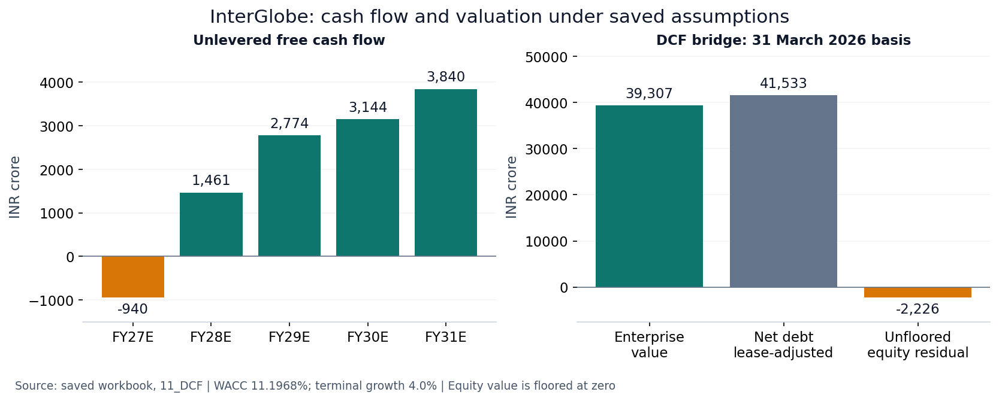

# InterGlobe Aviation Equity Research Model

Excel-based equity research and valuation model for InterGlobe Aviation (IndiGo). The project combines reported financial statements, airline operating drivers, management outlook, industry context, operating forecasts, and valuation analysis.

## Research summary

The model examines whether capacity growth and operating recovery translate into cash flow after fleet reinvestment and lease obligations. It separates operating progress from the equity value supported by the model's assumptions.

| Saved workbook output | Value |
|---|---:|
| FY2026 actual revenue | INR 84,961.9 crore |
| FY2031 forecast revenue | INR 153,031.2 crore |
| FY2031 forecast UFCF | INR 3,839.6 crore |
| WACC / terminal growth | 11.1968% / 4.0% |
| DCF enterprise value | INR 39,306.7 crore |
| Lease-adjusted net debt | INR 41,532.9 crore |
| Enterprise value less net debt | INR (2,226.2) crore |
| Implied equity value per share after zero floor | INR 0.00 |

The zero-floor outcome follows from enterprise value below lease-adjusted net debt in this simplified DCF. It is a model result, not a claim that the traded shares have no economic value. Its interpretation depends materially on lease/reinvestment treatment, the exclusion of other income from DCF operating profit and terminal assumptions. About 83.0% of enterprise value comes from the discounted terminal value.

## Explore the model

[Read the one-page research brief](docs/InterGlobe_Research_Brief.pdf) · [Download the Excel workbook](model/InterGlobe_Aviation_Equity_Research.xlsx). Begin with `00_Cover`, inspect operating drivers in `06_Operating_Model`, then review `11_DCF` and `12_Reverse_DCF`.

The valuation basis is **31 March 2026**. The workbook's **7 September 2026** market-price comparison is a separate dated observation, not a September valuation roll-forward. The FY2027 bear/base/bull comparison changes operating drivers; the WACC/terminal-growth sensitivity is a separate valuation analysis.

## Model coverage

- Historical income statement, balance sheet, cash flow, and operating KPIs from FY2016 to FY2026
- ASK, RPK, load factor, passengers, yield, PRASK, fuel CASK, and ex-fuel CASK analysis
- Base operating forecast for FY2027–FY2031, with a separate FY2027 bear/base/bull operating comparison
- Income statement forecast, supporting fleet, lease, asset and working-capital schedules, and unlevered free cash flow
- DCF valuation, sensitivity analysis, and reverse DCF

## Approach

Reported financial data is linked to the forecast through operating and cost drivers. Management commentary is identified separately from model assumptions. Industry traffic and market-share data provide context for the reasonableness of growth assumptions; they are not direct valuation inputs.

The forecast is an operating and valuation model. Historical balance sheets and cash-flow statements are included, but the forecast does not contain a complete assets/liabilities/equity balance sheet or a financing cash-flow statement. The Balance Sheet tab contains the supporting schedules.

DCF excludes all other income from operating profit as a simplifying assumption; operating compensation within other income is not separately forecast. Lease liabilities are treated as debt. Forecast reinvestment is estimated as depreciation plus the change in net PPE and right-of-use assets, assuming no disposals, impairments or FX revaluations. Historical UFCF uses cash capex only and is not directly comparable with that forecast measure. These simplifications require judgment when interpreting the valuation.

The DCF uses a 31 March 2026 valuation basis and year-end discounting. The market comparison uses the 7 September 2026 closing price and March balance-sheet debt/cash; it is not a valuation rolled forward to September. Equity value is floored at zero when enterprise value is below net debt; the unfloored difference remains visible. Reverse DCF scales all forecast cash flows and terminal cash flow uniformly, with WACC and terminal growth held constant.

## Worksheet order

00 Cover, 01 Sources, 02 Raw Financials, 03 Raw Operating KPIs, 04 Industry Data, 05 Historical Analysis, 06 Operating Model, 07 Income Statement, 08 Balance Sheet, 09 Cash Flow, 10 Scenarios, 11 DCF, 12 Reverse DCF.

The workbook follows standard financial-modelling conventions:

- Blue font: hard-coded inputs and assumptions
- Green font: links to other worksheets
- Black font: formulas and calculated values
- Negative values: shown in brackets

## Workbook

The completed model is available at [`model/InterGlobe_Aviation_Equity_Research.xlsx`](model/InterGlobe_Aviation_Equity_Research.xlsx).

Primary sources include InterGlobe Aviation annual reports, investor presentations, earnings-call transcripts, regulatory disclosures, DGCA and Ministry of Civil Aviation publications, and Screener. Source document names are listed within the workbook.

## Disclaimer

This is an independent research project prepared for demonstration purposes and is not investment advice.

## Related projects

[IFRS 9 ECL](https://github.com/keyurmarolia/ifrs9-mortgage-ecl) · [Basel credit capital](https://github.com/keyurmarolia/basel-credit-capital-engine) · [FRTB market risk](https://github.com/keyurmarolia/frtb-market-risk-engine) · [Momentum research](https://github.com/keyurmarolia/momentum-in-indian-equities-research)
